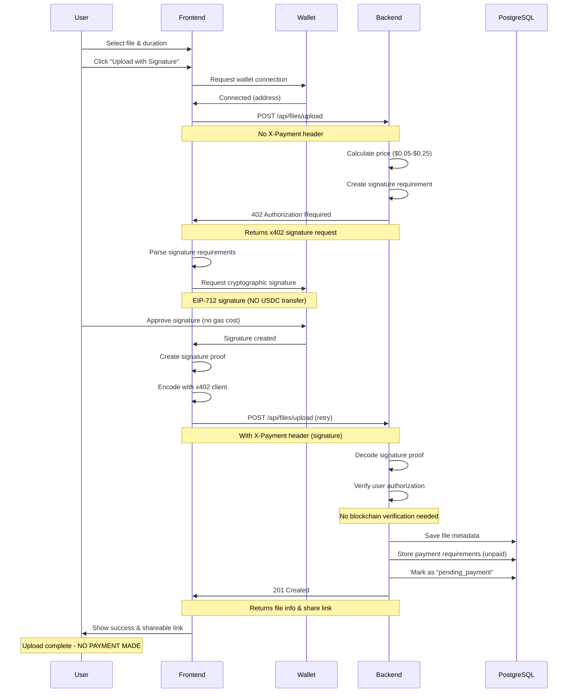
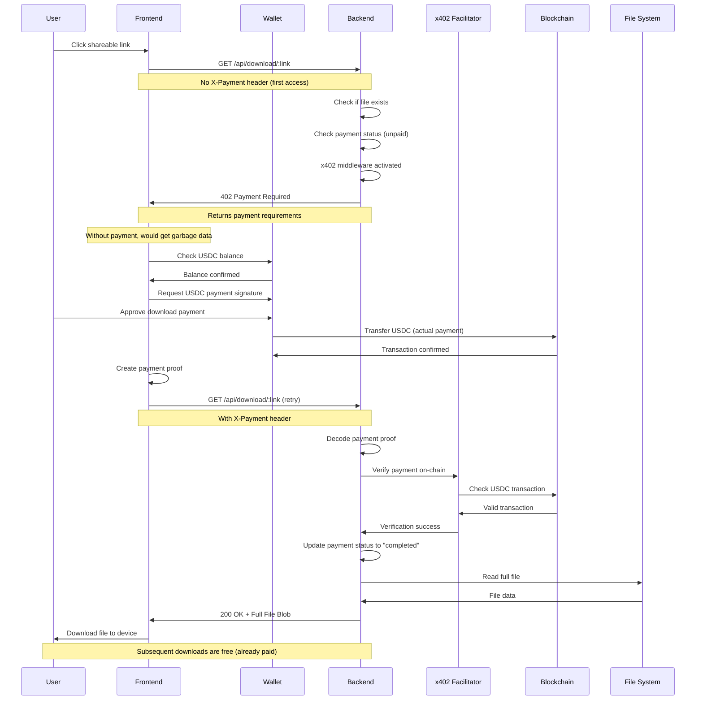

# 🚀 Temp File Storage with x402 Payment Protocol

A decentralized file storage application featuring **signature-based upload authorization** and **pay-per-download** using the **Coinbase x402 payment protocol** with USDC on Base Sepolia testnet.

[](https://x402.org)
[](https://base.org)
[](https://neon.tech)

---

## 📖 Table of Contents

- [Overview](#-overview)
- [x402 Protocol Integration](#-x402-protocol-integration)
- [Features](#-features)
- [Tech Stack](#️-tech-stack)
- [Architecture & Flow](#-architecture--flow)
- [Quick Start](#-quick-start)
- [Project Structure](#-project-structure)
- [API Endpoints](#-api-endpoints)
- [Payment Flow Diagrams](#-payment-flow-diagrams)
- [Configuration](#️-configuration)
- [Deployment](#-deployment)
- [Complete System Summary](#-complete-system-summary)
- [Troubleshooting](#-troubleshooting)

---

## 🎯 Overview

This application demonstrates an innovative implementation of the **Coinbase x402 payment protocol** for file storage services with **delayed payment model**. Users provide a cryptographic signature at upload time (no payment required) and pay with USDC only when accessing the file for the first time.

### What is x402?

**x402** is a payment protocol that enables seamless cryptocurrency payments for HTTP resources. Similar to HTTP status code 402 (Payment Required), x402 automates:
- Payment requirement detection (signature or payment)
- On-chain payment execution
- Payment verification
- Resource delivery after confirmation

### Key Highlights

✅ **Delayed Payment Model**: Sign at upload (free), pay only at first download  
✅ **Dynamic Pricing**: Different rates for 1, 7, or 30-day storage calculated at upload  
✅ **Custom x402 Implementation**: Modified protocol for signature authorization + delayed payment  
✅ **Access Protection**: Garbage data returned without payment, full file after payment  
✅ **On-chain Verification**: All payments verified via Base Sepolia blockchain  
✅ **Serverless Database**: PostgreSQL on Neon with auto-scaling  
✅ **Production Ready**: Deployed backend on Render.com

---

## 💰 x402 Protocol Integration

### How x402 Works in This App - Delayed Payment Model

This application uses a **customized x402 implementation** with two distinct phases:

#### 🔐 Phase 1: Upload (Signature Authorization - NO PAYMENT)

```
┌─────────────────────────────────────────────────────────────────┐
│              Upload Flow - Signature Only (Free)                 │
└─────────────────────────────────────────────────────────────────┘

1️⃣  User selects file & duration
    ↓
2️⃣  Backend returns: 402 Authorization Required
    {
      "x402Version": 1,
      "accepts": [{
        "scheme": "signature",  // ⚠️ Custom: Signature, not payment
        "network": "base-sepolia",
        "maxAmountRequired": "50000",  // Price calculated but NOT charged
        "payTo": "0xbc86ca947ab27b990054870566cfe849c2109d2d",
        "asset": "0x036CbD53842c5426634e7929541eC2318f3dCF7e"
      }]
    }
    ↓
3️⃣  Frontend x402 Client:
    - Connects wallet (RainbowKit + wagmi)
    - Requests cryptographic signature (EIP-712)
    - NO USDC transfer happens here
    - User signs authorization (no gas fees)
    ↓
4️⃣  Frontend retries with X-Payment header:
    X-Payment: <base64-encoded-signature-proof>
    ↓
5️⃣  Backend verifies signature:
    - Decodes signature proof
    - Validates user authorization
    - Stores file + payment requirements
    - Returns shareable link
    ↓
6️⃣  ✅ Upload Complete (No Payment Made)
    File accessible with shareable link
```

#### 💳 Phase 2: First Download (Actual USDC Payment)

```
┌─────────────────────────────────────────────────────────────────┐
│         Download Flow - Real Payment Required                    │
└─────────────────────────────────────────────────────────────────┘

1️⃣  User clicks shareable link
    ↓
2️⃣  Backend returns: 402 Payment Required
    {
      "x402Version": 1,
      "accepts": [{
        "scheme": "exact",  // Now requires actual payment
        "network": "base-sepolia",
        "maxAmountRequired": "50000",  // Must pay 0.05 USDC
        "payTo": "0xbc86ca947ab27b990054870566cfe849c2109d2d",
        "asset": "0x036CbD53842c5426634e7929541eC2318f3dCF7e"
      }]
    }
    ↓
3️⃣  Without payment:
    Backend returns GARBAGE DATA (file protected)
    ↓
4️⃣  Frontend x402 Client:
    - Checks USDC balance
    - Creates USDC payment transaction
    - User approves actual USDC transfer
    - Transfers USDC to receiver address
    ↓
5️⃣  Frontend retries with payment proof:
    X-Payment: <base64-encoded-payment-proof>
    ↓
6️⃣  Backend verifies payment:
    - Decodes payment proof
    - Validates on-chain USDC transaction
    - Verifies via x402 Facilitator (x402.org)
    - Marks file as "paid"
    ↓
7️⃣  ✅ Payment Confirmed → Full File Delivered
    Subsequent downloads are free (already paid)
```

### x402 Components Used

| Component | Purpose | Location |
|-----------|---------|----------|
| **x402 Client** | Frontend signature + payment handling | `frontend/src/services/x402Service.js` |
| **x402 Payment Client** | Frontend download payment flow | `frontend/src/services/x402Payment.js` |
| **x402 Helpers** | Backend verification (signature + payment) | `backend/utils/x402Helpers.js` |
| **x402 Middleware** | Download endpoint protection | `backend/routes/downloadRoutes.js` |
| **x402 Facilitator** | On-chain payment verification service | `https://x402.org/facilitator` |

### Why This Approach?

**Traditional x402**: Pay immediately for every resource access  
**Our Custom x402**: 
- ✅ **Upload**: Free with signature (better UX, no upfront cost)
- ✅ **Download**: Pay only when actually accessing file
- ✅ **Dynamic Pricing**: Price calculated at upload, charged at download
- ✅ **Access Control**: Garbage data without payment, full file after payment

---

## 🚀 Features

### 💳 Payment Features
- **Signature-based Upload**: Free upload with cryptographic signature authorization
- **Pay-per-Download**: USDC payment required only at first download
- **Dynamic Pricing**: Price calculated at upload based on duration (1/7/30 days)
- **Access Protection**: Protected files return garbage data until payment
- **One-time Payment**: Pay once, download multiple times
- **USDC Payments**: Stable cryptocurrency on Base Sepolia
- **Wallet Integration**: RainbowKit for easy wallet connection
- **On-chain Verification**: All payments verified on blockchain

### 📁 File Management
- **Large Files**: Support up to 100MB
- **Temporary Storage**: Auto-delete after expiry
- **Shareable Links**: Unique URLs for each file
- **Direct Downloads**: Backend serves files with payment verification
- **File Metadata**: Track size, type, upload date, expiry

### 🔐 Security & Reliability
- **Payment Verification**: x402 protocol ensures valid payments
- **Transaction Logging**: Complete audit trail
- **Serverless Database**: PostgreSQL on Neon (auto-scaling)
- **SSL/TLS**: Secure connections required
- **CORS Protection**: Configured for production

---

## 🛠️ Tech Stack

### Frontend
- **React 18** - UI framework
- **Vite** - Build tool and dev server
- **Tailwind CSS** - Styling
- **wagmi** - Ethereum React hooks
- **viem** - Ethereum client library
- **RainbowKit** - Wallet connection UI
- **x402 Client** - Payment protocol implementation
- **React Hot Toast** - Notifications
- **Axios** - HTTP client
- **React Router** - Navigation

### Backend
- **Node.js 18+** - Runtime
- **Express** - Web framework
- **PostgreSQL (Neon)** - Serverless database
- **x402 SDK** - Payment verification
- **Multer** - File upload handling
- **node-cron** - Scheduled file cleanup
- **dotenv** - Environment configuration

### Blockchain & Payments
- **Base Sepolia** - L2 testnet
- **USDC** - Stablecoin (testnet)
- **x402 Protocol** - Payment standard
- **x402 Facilitator** - Payment verification service

---

## 🏗 Architecture & Flow

### System Architecture

```
┌──────────────────────────────────────────────────────────────────┐
│                         User's Browser                            │
│  ┌──────────────────────────────────────────────────────────┐   │
│  │  Frontend (React + Vite)                                  │   │
│  │  - RainbowKit Wallet UI                                   │   │
│  │  - x402 Client (Payment Handling)                         │   │
│  │  - File Upload/Download Components                        │   │
│  └──────────────────────────────────────────────────────────┘   │
└───────────────────────────┬──────────────────────────────────────┘
                            │
                            │ HTTP Requests
                            │ x402 Payment Headers
                            ↓
┌──────────────────────────────────────────────────────────────────┐
│                  Backend (Node.js + Express)                      │
│  ┌──────────────────────────────────────────────────────────┐   │
│  │  API Routes                                               │   │
│  │  - POST /api/files/upload (x402 protected)               │   │
│  │  - GET  /api/download/:link (x402 middleware)            │   │
│  │  - GET  /api/files/info/:link                            │   │
│  └──────────────────────────────────────────────────────────┘   │
│  ┌──────────────────────────────────────────────────────────┐   │
│  │  x402 Verification System                                │   │
│  │  - Parse payment headers                                 │   │
│  │  - Decode payment proofs                                 │   │
│  │  - Verify with facilitator                               │   │
│  └──────────────────────────────────────────────────────────┘   │
└───────────────────────────┬──────────────────────────────────────┘
                            │
                ┌───────────┼───────────┐
                │           │           │
                ↓           ↓           ↓
    ┌────────────────┐ ┌─────────────┐ ┌──────────────────┐
    │   PostgreSQL   │ │ File System │ │  x402 Facilitator│
    │  (Neon Cloud)  │ │  (Uploads)  │ │  (x402.org)      │
    │                │ │             │ │                  │
    │  - Files DB    │ │  - 100MB    │ │  - Verify txs    │
    │  - Payments DB │ │  - Auto-    │ │  - On-chain      │
    │  - Txs DB      │ │    cleanup  │ │    validation    │
    └────────────────┘ └─────────────┘ └──────────────────┘
```

### Complete Upload Flow



### Complete Download Flow



---

## 📋 Pricing

| Duration | Upload Fee | First Download Fee | Total Cost | Subsequent Downloads |
|----------|------------|--------------------|------------|---------------------|
| 1 Day    | FREE (signature only) | $0.05 USDC | $0.05 USDC | FREE |
| 7 Days   | FREE (signature only) | $0.15 USDC | $0.15 USDC | FREE |
| 30 Days  | FREE (signature only) | $0.25 USDC | $0.25 USDC | FREE |

**How it works:**
1. **Upload**: Sign with your wallet (no payment, no gas fees)
2. **First Download**: Pay the full amount via USDC
3. **Additional Downloads**: Free forever (already paid)

---

## 🚀 Quick Start

### Prerequisites

- **Node.js** 18+ and npm
- **PostgreSQL** (local) OR **Neon account** (cloud)
- **Crypto Wallet** with Base Sepolia USDC (get testnet USDC from [faucet](https://www.base.org/faucets))
- **Git** (to clone the repository)

### Installation

#### 1. Clone the Repository

```bash
cd ~/Desktop
git clone <your-repo-url>
cd new5
```

#### 2. Backend Setup

```bash
cd backend

# Install dependencies
npm install

# Create .env file
cp .env.example .env
# OR create manually:
nano .env
```

**Configure `.env` file:**

```env
# Server Configuration
PORT=5001
NODE_ENV=development

# Database Configuration (Choose Local OR Neon)

# Option A: Local PostgreSQL
DB_HOST=localhost
DB_PORT=5432
DB_NAME=temp_file_storage
DB_USER=your_postgres_user
DB_PASSWORD=your_postgres_password
DB_SSL=false

# Option B: Neon PostgreSQL (Recommended for production)
# DB_HOST=your-neon-endpoint.neon.tech
# DB_PORT=5432
# DB_NAME=temp_file_storage
# DB_USER=neondb_owner
# DB_PASSWORD=your_neon_password
# DB_SSL=true

# x402 Configuration
RECEIVER_WALLET_ADDRESS=0xbc86ca947ab27b990054870566cfe849c2109d2d
X402_NETWORK=base-sepolia
X402_FACILITATOR_URL=https://x402.org/facilitator

# Frontend URL (for CORS)
FRONTEND_URL=http://localhost:5173
```

**If using local PostgreSQL, create database:**

```bash
# Connect to PostgreSQL
psql -U postgres

# Create database
CREATE DATABASE temp_file_storage;

# Exit
\q
```

**Start the backend:**

```bash
npm run dev
```

Expected output:
```
✅ Connected to PostgreSQL database
✅ Database connection successful
✅ Database tables initialized successfully
🚀 Server is running on port 5001
💰 x402 Payment Network: base-sepolia
```

Backend runs at: `http://localhost:5001`

#### 3. Frontend Setup

Open a new terminal:

```bash
cd frontend

# Install dependencies
npm install

# Create .env file
nano .env
```

**Configure frontend `.env`:**

```env
# API URL (local backend)
VITE_API_URL=http://localhost:5001/api

# WalletConnect Project ID (get from https://cloud.walletconnect.com)
VITE_WALLETCONNECT_PROJECT_ID=your_project_id

# Receiver wallet address (should match backend)
VITE_RECEIVER_WALLET_ADDRESS=0xbc86ca947ab27b990054870566cfe849c2109d2d
```

**Start the frontend:**

```bash
npm run dev
```

Expected output:
```
  VITE v5.x.x  ready in xxx ms

  ➜  Local:   http://localhost:5173/
  ➜  Network: use --host to expose
```

Frontend runs at: `http://localhost:5173`

#### 4. Test the Application

1. **Open browser**: Navigate to `http://localhost:5173`
2. **Connect wallet**: Click "Connect Wallet" button (use MetaMask or any Web3 wallet)
3. **Switch to Base Sepolia**: Ensure wallet is on Base Sepolia testnet
4. **Get testnet USDC**: Visit [Base faucet](https://www.base.org/faucets) (needed for download payment only)
5. **Upload a file** (FREE):
   - Select file (max 100MB)
   - Choose duration (1, 7, or 30 days)
   - Click "Upload with Signature"
   - **Sign the authorization** in wallet (no payment, no gas fees)
   - Wait for confirmation
   - ✅ File uploaded successfully!
6. **Get shareable link**: Copy the generated link
7. **Test download** (PAYMENT REQUIRED):
   - Paste link in new tab or click "Download" button
   - First attempt shows payment requirement
   - Click "Pay & Download"
   - Approve USDC payment in wallet (actual payment happens here)
   - File downloads automatically after payment
8. **Test subsequent downloads** (FREE):
   - Use the same link again
   - File downloads immediately without payment

---

## 📁 Project Structure

```
new5/
├── README.md                          # This file
├── NEON_DEPLOYMENT_GUIDE.md          # Neon PostgreSQL setup guide
├── X402_INTEGRATION_COMPLETE.md      # x402 implementation details
├── SHAREABLE_LINK_FIX.md             # Link generation documentation
│
├── frontend/                          # React frontend application
│   ├── package.json                  # Frontend dependencies
│   ├── vite.config.js                # Vite configuration
│   ├── tailwind.config.js            # Tailwind CSS config
│   ├── .env                          # Frontend environment variables
│   │
│   └── src/
│       ├── App.jsx                   # Main app component
│       ├── main.jsx                  # Entry point
│       │
│       ├── components/
│       │   ├── FileUpload.jsx        # Upload UI with x402 payment
│       │   ├── PaymentSuccess.jsx    # Success screen with shareable link
│       │   ├── Hero.jsx              # Landing page hero
│       │   └── Footer.jsx            # Footer component
│       │
│       ├── pages/
│       │   └── Download.jsx          # Download page with x402 payment
│       │
│       ├── services/
│       │   ├── api.js                # Axios API client
│       │   ├── x402Service.js        # x402 upload payment handling
│       │   └── x402Payment.js        # x402 download payment handling
│       │
│       ├── config/
│       │   └── web3.js               # RainbowKit & wagmi configuration
│       │
│       └── utils/
│           └── helpers.js            # Utility functions
│
└── backend/                           # Node.js backend server
    ├── package.json                  # Backend dependencies
    ├── server.js                     # Express server entry point
    ├── .env                          # Backend environment variables
    ├── test-neon-connection.js       # Neon database connection test
    │
    ├── config/
    │   ├── database.js               # PostgreSQL connection & initialization
    │   ├── pricing.js                # Dynamic pricing configuration
    │   └── upload.js                 # Multer file upload config
    │
    ├── models/
    │   ├── fileModel.js              # File database operations
    │   ├── paymentModel.js           # Payment database operations
    │   └── transactionModel.js       # Transaction logging
    │
    ├── routes/
    │   ├── fileRoutes.js             # Upload endpoint (x402 protected)
    │   ├── downloadRoutes.js         # Download endpoint (x402 middleware)
    │   └── paymentRoutes.js          # Payment status endpoints
    │
    ├── utils/
    │   ├── x402Helpers.js            # x402 payment verification helpers
    │   ├── helpers.js                # General utility functions
    │   └── scheduler.js              # Cron job for file cleanup
    │
    └── uploads/                       # File storage directory (gitignored)
        └── .gitkeep
```

---

## 🔌 API Endpoints

### File Management

#### Upload File (x402 Signature Protected)
```http
POST /api/files/upload
Content-Type: multipart/form-data

Body:
- file: <binary file data>
- duration: <1 | 7 | 30>

Headers (on retry after signature):
- X-Payment: <base64-encoded-signature-proof>

Response (402 - Authorization Required - First Request):
{
  "x402Version": 1,
  "error": "X-PAYMENT header is required",
  "accepts": [{
    "scheme": "signature",  // Custom: Signature, not payment
    "network": "base-sepolia",
    "maxAmountRequired": "50000",  // Price calculated but NOT charged
    "payTo": "0xbc86ca947ab27b990054870566cfe849c2109d2d",
    "resource": "http://localhost:5001/api/files/upload",
    "description": "Upload file for 1 day(s) - Signature Required",
    "asset": "0x036CbD53842c5426634e7929541eC2318f3dCF7e"
  }]
}

Response (201 - Success After Signature):
{
  "success": true,
  "message": "File uploaded successfully - Payment required at download",
  "data": {
    "fileId": "uuid",
    "filename": "example.pdf",
    "size": 1048576,
    "duration": 1,
    "price": "0.05",  // Price stored, not charged yet
    "shareLink": "abc123def",
    "expiryDate": "2025-11-14T10:00:00.000Z",
    "paymentStatus": "pending_payment"  // Not paid yet
  }
}
```

#### Get File Info
```http
GET /api/files/info/:shareLink

Response (200):
{
  "success": true,
  "data": {
    "fileId": "uuid",
    "filename": "example.pdf",
    "size": 1048576,
    "mimeType": "application/pdf",
    "duration": 1,
    "price": "0.05",
    "shareLink": "abc123def",
    "expiryDate": "2025-11-14T10:00:00.000Z",
    "paymentStatus": "pending_payment",  // or "completed" after first download
    "createdAt": "2025-11-13T10:00:00.000Z"
  }
}
```

### Download

#### Download File (x402 Payment Protected)
```http
GET /api/download/:shareLink

Headers (after payment):
- X-Payment: <base64-encoded-payment-proof>

Response (402 - First Download - Payment Required):
{
  "x402Version": 1,
  "error": "X-PAYMENT header is required - First download requires payment",
  "accepts": [{
    "scheme": "exact",  // Actual USDC payment required
    "network": "base-sepolia",
    "maxAmountRequired": "50000",  // Must pay 0.05 USDC
    "payTo": "0xbc86ca947ab27b990054870566cfe849c2109d2d",
    "resource": "http://localhost:5001/api/download/abc123def",
    "description": "Download file - One-time payment",
    "asset": "0x036CbD53842c5426634e7929541eC2318f3dCF7e"
  }]
}

Response (200 - Without Payment - Garbage Data):
Content-Type: application/octet-stream
Content-Disposition: attachment; filename="protected.bin"
<garbage/encrypted data - file is protected>

Response (200 - After Payment - Full File):
Content-Type: <file-mime-type>
Content-Disposition: attachment; filename="example.pdf"
<full file binary data>

Response (200 - Subsequent Downloads - No Payment):
Content-Type: <file-mime-type>
Content-Disposition: attachment; filename="example.pdf"
<full file binary data>
Note: File already paid for, no X-Payment header needed
```

### System

#### Health Check
```http
GET /api/health

Response:
{
  "status": "healthy",
  "timestamp": "2025-11-13T10:00:00.000Z",
  "database": "connected",
  "uptime": 12345
}
```

---

## 📊 Payment Flow Diagrams

### Upload Flow (Signature Authorization - FREE)

```
┌──────────┐
│  User    │
│ Selects  │
│   File   │
└────┬─────┘
     │
     ↓
┌──────────────────────────┐
│   Frontend              │
│   - Validates file      │
│   - Checks wallet       │
│   - Sends POST request  │
└────────┬─────────────────┘
         │
         │ POST /api/files/upload
         │ (No X-Payment header)
         ↓
┌──────────────────────────┐
│   Backend               │
│   - Calculates price    │
│   - Creates signature   │
│     requirement (x402)  │
│   - Returns 402 Auth    │
└────────┬─────────────────┘
         │
         │ 402 Authorization Required
         │ {scheme: "signature"}
         ↓
┌──────────────────────────┐
│   x402 Client           │
│   - Parses signature    │
│     requirements        │
│   - NO USDC check       │
│   - NO payment needed   │
└────────┬─────────────────┘
         │
         │ Request signature (EIP-712)
         ↓
┌──────────────────────────┐
│   Wallet (MetaMask)     │
│   - Shows signature req │
│   - User signs (FREE)   │
│   - NO USDC transfer    │
└────────┬─────────────────┘
         │
         │ Signature created
         ↓
┌──────────────────────────┐
│   x402 Client           │
│   - Creates sig proof   │
│   - Encodes header      │
│   - Retries upload      │
└────────┬─────────────────┘
         │
         │ POST /api/files/upload
         │ X-Payment: <signature-proof>
         ↓
┌──────────────────────────┐
│   Backend               │
│   - Decodes signature   │
│   - Verifies authority  │
│   - NO blockchain check │
└────────┬─────────────────┘
         │
         │ Signature valid
         │ (No facilitator needed)
         ↓
┌──────────────────────────┐
│   Backend               │
│   - Saves file          │
│   - Stores price info   │
│   - Status: "pending"   │
└────────┬─────────────────┘
         │
         │ 201 Created (NO PAYMENT)
         │ {shareLink: "abc123",
         │  paymentStatus: "pending"}
         ↓
┌──────────────────────────┐
│   Frontend              │
│   - Shows success       │
│   - Displays link       │
│   - "Download" button   │
│   Note: Upload FREE!    │
└──────────────────────────┘
```

### Download Flow (USDC Payment Required)

```
┌──────────┐
│  User    │
│  Clicks  │
│   Link   │
└────┬─────┘
     │
     ↓
┌──────────────────────────┐
│   Frontend              │
│   - Loads download page │
│   - Fetches file info   │
│   - Shows "Pay & DL"    │
└────────┬─────────────────┘
         │
         │ User clicks "Pay & Download"
         ↓
┌──────────────────────────┐
│   Frontend              │
│   - Sends GET request   │
│   - No payment yet      │
└────────┬─────────────────┘
         │
         │ GET /api/download/:link
         ↓
┌──────────────────────────┐
│   Backend               │
│   - Checks payment      │
│     status (unpaid)     │
│   - x402 middleware     │
│   - Returns 402 PAYMENT │
└────────┬─────────────────┘
         │
         │ 402 Payment Required
         │ {scheme: "exact", amount: "50000"}
         ↓
┌──────────────────────────┐
│   x402 Download Client  │
│   - Parses payment req  │
│   - Checks USDC balance │
│   - Initiates payment   │
└────────┬─────────────────┘
         │
         │ Request USDC payment
         ↓
┌──────────────────────────┐
│   Wallet (MetaMask)     │
│   - Shows USDC amount   │
│   - User approves       │
│   - Transfers USDC      │
└────────┬─────────────────┘
         │
         │ USDC payment confirmed
         ↓
┌──────────────────────────┐
│   Blockchain            │
│   - Records USDC tx     │
│   - Confirms transfer   │
└────────┬─────────────────┘
         │
         │ Transaction hash
         ↓
┌──────────────────────────┐
│   x402 Download Client  │
│   - Creates payment     │
│     proof with tx hash  │
│   - Retries download    │
└────────┬─────────────────┘
         │
         │ GET /api/download/:link
         │ X-Payment: <payment-proof>
         ↓
┌──────────────────────────┐
│   Backend               │
│   - Decodes proof       │
│   - Verifies with x402  │
│     Facilitator         │
└────────┬─────────────────┘
         │
         │ Verification request
         ↓
┌──────────────────────────┐
│   x402 Facilitator      │
│   - Queries blockchain  │
│   - Validates USDC tx   │
│   - Returns ✅ valid    │
└────────┬─────────────────┘
         │
         │ ✅ Valid payment
         ↓
┌──────────────────────────┐
│   Backend               │
│   - Updates status to   │
│     "completed"         │
│   - Reads full file     │
│   - Streams to client   │
└────────┬─────────────────┘
         │
         │ 200 OK + Full File
         ↓
┌──────────────────────────┐
│   Browser               │
│   - Receives file       │
│   - Triggers download   │
│   - Saves to disk       │
│   Note: Paid once,      │
│         free forever!   │
└──────────────────────────┘
```

---

## ⚙️ Configuration

### Backend Environment Variables

| Variable | Description | Example | Required |
|----------|-------------|---------|----------|
| `PORT` | Backend server port | `5001` | Yes |
| `NODE_ENV` | Environment mode | `development` / `production` | Yes |
| `DB_HOST` | PostgreSQL host | `localhost` or Neon endpoint | Yes |
| `DB_PORT` | PostgreSQL port | `5432` | Yes |
| `DB_NAME` | Database name | `temp_file_storage` | Yes |
| `DB_USER` | Database user | `postgres` / `neondb_owner` | Yes |
| `DB_PASSWORD` | Database password | Your password | Yes |
| `DB_SSL` | Enable SSL | `true` / `false` | Yes (true for Neon) |
| `RECEIVER_WALLET_ADDRESS` | x402 payment receiver | `0xbc86...` | Yes |
| `X402_NETWORK` | Blockchain network | `base-sepolia` | Yes |
| `X402_FACILITATOR_URL` | x402 verification service | `https://x402.org/facilitator` | Yes |
| `FRONTEND_URL` | CORS allowed origin | `http://localhost:5173` | Yes |

### Frontend Environment Variables

| Variable | Description | Example | Required |
|----------|-------------|---------|----------|
| `VITE_API_URL` | Backend API URL | `http://localhost:5001/api` | Yes |
| `VITE_WALLETCONNECT_PROJECT_ID` | WalletConnect project ID | Get from [cloud.walletconnect.com](https://cloud.walletconnect.com) | Yes |
| `VITE_RECEIVER_WALLET_ADDRESS` | Display payment receiver | `0xbc86...` | Yes |

---

## 🌐 Deployment

### Deploy Backend (Render.com)

1. **Create Render account**: [render.com](https://render.com)
2. **Create New Web Service**:
   - Connect GitHub repository
   - Select `backend` folder
   - Build Command: `npm install`
   - Start Command: `npm start`
3. **Add Environment Variables**: Copy all from `.env`
4. **Deploy**: Render will build and start your backend
5. **Get URL**: e.g., `https://tempfilestorage.onrender.com`

### Deploy Frontend (Vercel)

// ...existing deployment content...

---

## 📝 Complete System Summary

### 🎯 What Makes This Implementation Unique?

This project implements a **customized x402 protocol** with a **delayed payment model**:

#### Traditional x402 Protocol
- User requests resource → 402 Payment Required → Pay → Get resource

#### Our Custom x402 Implementation
- **Upload Phase**: Signature authorization (FREE, no blockchain interaction)
- **Download Phase**: Actual USDC payment (on-chain verification)

### 🔄 Complete User Journey

#### 1️⃣ Upload File (Signature Authorization)
```
User selects file
   ↓
Backend calculates price ($0.05-$0.25 based on duration)
   ↓
Backend returns 402 with scheme: "signature"
   ↓
Frontend requests wallet signature (EIP-712)
   ↓
User signs (no USDC transfer, no gas fees)
   ↓
Frontend sends signature proof to backend
   ↓
Backend verifies signature + saves file
   ↓
File stored with status: "pending_payment"
   ↓
✅ Shareable link generated immediately
```

**Result**: Upload is completely FREE. Price is calculated and stored but not charged.

#### 2️⃣ First Download (USDC Payment)
```
User clicks shareable link
   ↓
Frontend checks payment status (unpaid)
   ↓
User clicks "Pay & Download $0.05"
   ↓
Backend returns 402 with scheme: "exact" (real payment)
   ↓
Frontend initiates USDC transfer
   ↓
User approves USDC payment in wallet
   ↓
Blockchain records transaction
   ↓
Frontend sends payment proof to backend
   ↓
Backend verifies via x402 Facilitator
   ↓
x402 Facilitator checks on-chain transaction
   ↓
Backend updates status: "completed"
   ↓
✅ Full file downloaded
```

**Result**: User pays only when accessing file for the first time.

#### 3️⃣ Subsequent Downloads (Free)
```
User clicks same shareable link
   ↓
Backend checks payment status (completed)
   ↓
✅ Direct file download (no payment needed)
```

**Result**: Once paid, file is accessible forever (until expiry).

### 🔐 Access Protection

**Without Payment**:
- File exists but is protected
- Returns garbage/encrypted data
- User cannot access actual content

**After Payment**:
- Full file content accessible
- Normal download behavior
- Free for all future downloads

### 🛠️ Custom x402 Components

#### Backend (`backend/utils/x402Helpers.js`)
- **Signature verification**: Validates user authorization without blockchain
- **Payment verification**: Full on-chain verification via x402 Facilitator
- **Dynamic pricing**: Calculates price at upload, charges at download

#### Frontend (`frontend/src/services/`)
- **x402Service.js**: Upload signature handling (no payment)
- **x402Payment.js**: Download payment handling (actual USDC transfer)

### 💡 Key Benefits

✅ **Better UX**: Users don't need USDC to upload  
✅ **Lower Barriers**: No upfront payment reduces friction  
✅ **Fair Pricing**: Pay only if you actually use the file  
✅ **One-time Payment**: Download unlimited times after paying once  
✅ **Access Control**: Files protected until payment  
✅ **Blockchain Verified**: All payments verified on-chain  

### 🔄 Payment Status Flow

```
Upload → "pending_payment" (signature verified, file stored)
   ↓
First Download → "completed" (USDC paid, verified on-chain)
   ↓
Subsequent Downloads → "completed" (already paid, free access)
```

---

## 🐛 Troubleshooting
